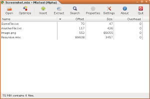

Welcome to Mixtool!
====================

Mixtool is a platform independent editor for Westwood&nbsp;Studios’ MIX files.  
These files are used by the classic Command&nbsp;&&nbsp;Conquer games.

	

	
Download released sources:

	
Download latest sources:

	
View GitHub repository:

At the current development state, the software is able to extract from, insert into and list the contents of *unecrypted* MIX files from Tiberian&nbsp;Dawn, Red&nbsp;Alert, Tiberian&nbsp;Sun, Red&nbsp;Alert&nbsp;2 and Yuri’s&nbsp;Revenge. It is not ready for productive use. Support for encrypted files and Renegade will be added later.

To run the alpha version, you also need to have recent versions of Python&nbsp;3, GTK+&nbsp;3 and PyGObject installed. Final versions will be packaged for easy use by everyone.

Licensing
----------

| Software      | Documentation              |
| ------------- | -------------------------- |
| [![GPLv3]][0] | [![GPLv3]][0] [![GFDL]][1] |

[GPLv3]: assets/gpl3.svg
[GFDL]: assets/gfdl.svg
[0]: javascript:self.location='gpl3.html'
[1]: javascript:self.location='gfdl.html'
