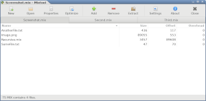

Welcome to Mixtool!
===================

Mixtool is a platform independent editor for Westwood&nbsp;Studios’ MIX files.  
These files are used by the classic Command&nbsp;&amp;&nbsp;Conquer games.

At the current development state, the software is able to extract from,
insert into and list the contents of *unecrypted* MIX files from Tiberian&nbsp;Dawn,
Red&nbsp;Alert, Tiberian&nbsp;Sun, Red&nbsp;Alert&nbsp;2 and Yuri’s&nbsp;Revenge.
It is not ready for productive use. Support for encrypted files and Renegade will be added later.

To run the alpha version, you also need to have recent versions of Python&nbsp;3,
GTK+&nbsp;3 and PyGObject installed. Final versions will be packaged for easy use by everyone.

Notes on development
--------------------

Mixtool is developed and tested on an [Arch Linux](https://www.archlinux.org/) system.
Even though most things also work on Windows and macOS, I’m not going to optimize for
that systems until reaching beta. This means that, while important code is written
with platform independence in mind, features that require extensive extra work, like
application uniqueness or opening files from the Finder, will not work in the alpha versions.

Another thing is that, when I started to work on Mixtool, I knew very little about Python and
almost nothing about GObject and GTK+, so this is both, learning-by-doing and a reference project.
Because of that, a lot of code has been rewritten since the release of Alpha 0.1, and Alpha 0.2
will be more about changes under the hood than adding new features. I know that support for
encrypted headers is crucial, but it will have to wait until Alpha 0.3, when the code cleanup
is complete.

Versioning
----------

Mixtool tries to follow the [Semantic Versioning specification][0], even
though, as a front-end application, it has no public API to be used by
other applications. Alpha versions released during rapid development are
tagged v0.x.x and should be safe to run without causing mayhem. They are
usually released when a milestone is reached. No features are guaranteed
to work. Everything can change during this period and neither binaries
nor upgrade routines are provided. Final versions will be tagged v1.x.x
and have their pre-releases suffixed by “-beta” or “-rc”, optionally
followed by a dot and some number. The suffix “-volatile” is used in
trunk between releases and denotes changing code prior to a release. It
is never used in tags. Version descriptions used in headlines or about
dialogs are not semantic, may include codenames, and are solely meant
for human perception.

License
-------

| Software      | Documentation              |
| ------------- | -------------------------- |
| [![GPLv3]][1] | [![GPLv3]][1] [![GFDL]][2] |

[GPLv3]: assets/gpl3.svg
[GFDL]: assets/gfdl.svg
[0]: https://semver.org/spec/v2.0.0.html
[1]: javascript:self.location='gpl3.html'
[2]: javascript:self.location='gfdl.html'
